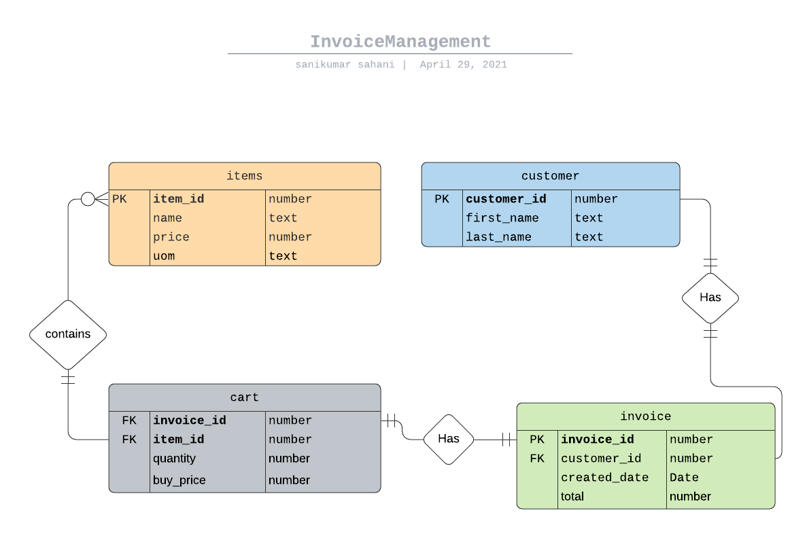
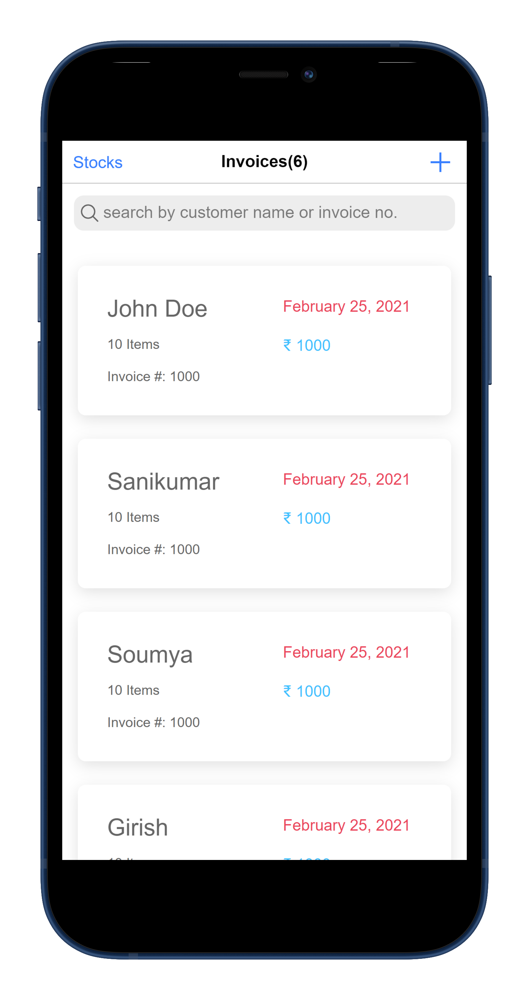
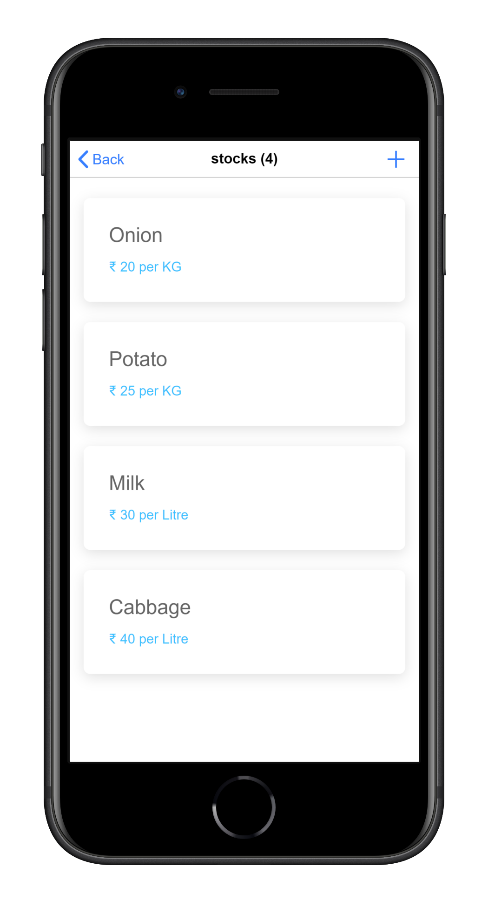
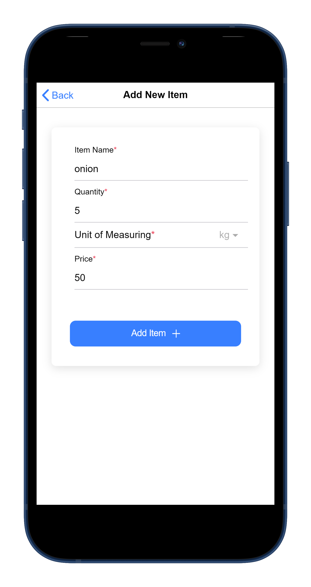
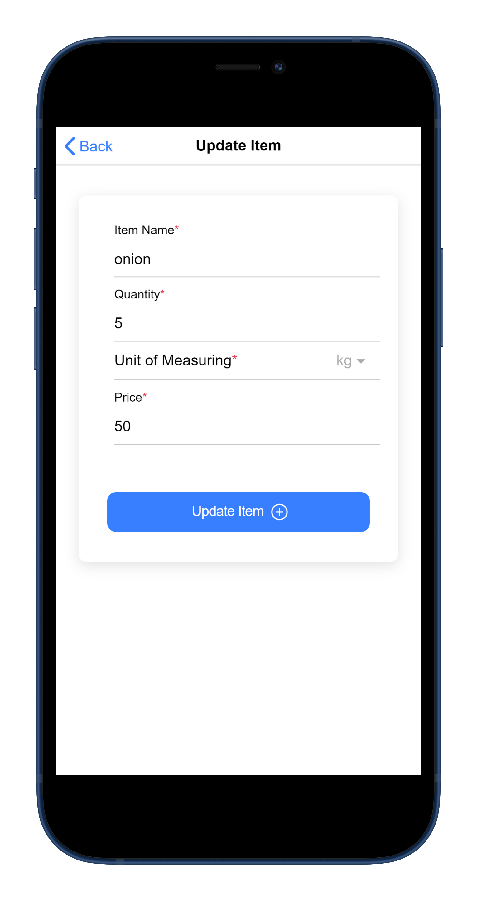

# Ionic-Android-Invoice-app-Sanikumar

## Data Model of the Application

## [Used this site for designing the DataModel](https://lucid.app/users/login)

Screenshots of the application.

Screen 1               |  Screen 2                       | Screen 3                            |  Screen 4
:-------------------------:|:-------------------------:|:-------------------------:|:-------------------------:
||||
